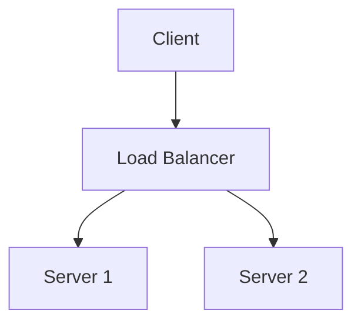

Mermaidを導入するところまではすぐできたけど、ライトモードとダークモードの切り替えに追従させようとして若干手間取ったので覚え書き。

<p style="text-align: center;">↓ こういう図</p>



テーマ切り替えのために以下の2つのアプローチを試した。

1. クライアントサイドで図を都度生成（テーマ切り替え時に再生成）
2. ビルド時にインラインSVGとして埋め込み、CSS変数を経由してテーマ切り替え

結局1番目のアプローチを採用した。(最初は2番目の方法を試してたけど、めんどくさすぎて断念)

コードの全体像は[PR](https://github.com/hat0uma/www/pull/2)参照。

## 目次

<!--toc:start-->
- [パッケージのインストール](#パッケージのインストール)
- [rehype-mermaidの設定](#rehype-mermaidの設定)
- [クライアントサイドでのレンダリング](#クライアントサイドでのレンダリング)
- [テーマ切り替えの実装](#テーマ切り替えの実装)
- [まとめ](#まとめ)
- [補足(没案): インラインSVGとCSS変数でテーマ変更](#補足没案-インラインsvgとcss変数でテーマ変更)
<!--toc:end-->

## パッケージのインストール

必要なパッケージをインストールする。`mermaid`はクライアントサイドへ配布する。

```bash
pnpm add rehype-mermaid playwright mermaid
```

## rehype-mermaidの設定

`astro.config.mjs`で`rehype-mermaid`を設定する。`strategy`を`pre-mermaid`に設定するのがポイント。

```javascript file="astro.config.mjs"
// ...
import rehypeMermaid from "rehype-mermaid"; // [!code ++]

export default defineConfig({
  // ...
  markdown: {
    rehypePlugins: [[rehypeMermaid, { strategy: "pre-mermaid" }]], // [!code ++]
    // ...
  },
});
```

`strategy`を`pre-mermaid`に設定すると、ビルド時にMermaidのコードブロックがSVGに変換されず、以下のように`class="mermaid"`を持つ`<pre>`タグとしてHTMLに出力される。
この`<pre>`タグ内のコードを、クライアントサイドのjsで図に変換する。

```html file="出力されるHTMLのイメージ"
<pre class="mermaid">
graph TD
    A[Client] --> B[Load Balancer]
    B --> C[Server 1]
    B --> D[Server 2]
</pre>
```

## クライアントサイドでのレンダリング

次に、クライアントサイドでMermaidの図をレンダリングする。
`mermaid.initialize()`で初期化して、ページ遷移時に`mermaid.run()`を実行したら`<pre class="mermaid">`がSVGに変換される。テーマの切り替えをしないならこれで終わり。

```javascript file="クライアントサイドスクリプト"
import mermaid from "mermaid";

// デフォルトのテーマを指定して初期化
mermaid.initialize({ theme: "dark", startOnLoad: false });
// ページが読み込まれるたびにMermaidのレンダリングを実行
document.addEventListener("astro:page-load", async () => {
  await mermaid.run();
});
```

## テーマ切り替えの実装

ここからがテーマ切り替え。最初はもう一度`mermaid.initialize({ theme })`を呼び出せばいいと思ったけど、うまくいかなかった。
理由は、一度`mermaid.run()`で描画された図の`<pre>`要素からは、元のMermaidコードが削除されてしまうから。

描画後のHTMLを見てみると、以下のように`data-processed="true"`という属性がついて、`<pre>`タグの中身がSVGに置き換わっていることがわかる。

```html file="描画前後のHTMLの比較"
<pre class="mermaid"><!-- [!code --] -->
graph TD <!-- [!code --] -->
    A[Client] --> B[Load Balancer]<!-- [!code --] -->
    B --> C[Server 1]<!-- [!code --] -->
    B --> D[Server 2]<!-- [!code --] -->
</pre><!-- [!code --] -->
<pre class="mermaid" data-processed="true"><!-- [!code ++] -->
  <svg id="mermaid-1762685428736">...</svg><!-- [!code ++] -->
</pre><!-- [!code ++] -->
```

というわけでワークアラウンド気味だが、[Issueコメント](https://github.com/mermaid-js/mermaid/issues/1945#issuecomment-1661264708)を参考に次のような処理フローで実装。

### 初回描画時の処理

1. `<pre>`タグ内にある元のMermaidコードを、`data-original-code`属性にバックアップとして退避
2. 現在のテーマで`mermaid.initialize({ theme })`を実行
3. `mermaid.run()`を実行して図を描画

### テーマ切り替え時の処理

1. `data-processed`属性を持つ図を検索し、`data-original-code`属性に退避させておいたMermaidコードを`<pre>`タグ内に復元
2. 新しいテーマで`mermaid.initialize({ theme })`を再実行
3. `mermaid.run()`を実行して、復元したコードを元に新しいテーマで図を再描画

### 実装

実装したコードは以下

```ts file="src/utils/mermaid.ts"
import type { MermaidConfig } from "mermaid";

// ページ内のMermaid要素をすべて取得する
const getMermaidElements = (): NodeListOf<HTMLElement> =>
  document.querySelectorAll(".mermaid");

/**
 * 指定されたテーマでMermaidの図をレンダリングする
 */
export const renderDiagrams = async (
  theme: MermaidConfig["theme"],
  dark: boolean
) => {
  const elements = getMermaidElements();
  if (elements.length === 0) {
    return;
  }

  // 動的にmermaidをインポート
  const mermaid = (await import("mermaid")).default;

  mermaid.initialize({ theme, startOnLoad: false, darkMode: dark });
  await mermaid.run({ nodes: elements });
};

/**
 * レンダリング前のMermaidコードをdata-original-code属性に退避させる
 */
export const saveMermaidCodes = () => {
  const elements = getMermaidElements();
  for (const element of elements) {
    if (!element.hasAttribute("data-original-code")) {
      element.setAttribute("data-original-code", element.innerHTML);
    }
  }
};

/**
 * 描画済みのMermaid図をレンダリング前の状態（Mermaidコード）に戻す
 */
export const resetProcessedDiagrams = () => {
  const elements = getMermaidElements();
  for (const element of elements) {
    // data-processed属性がなければ未処理なのでスキップ
    if (!element.hasAttribute("data-processed")) {
      continue;
    }

    const originalCode = element.getAttribute("data-original-code");
    if (originalCode != null) {
      element.removeAttribute("data-processed");
      element.innerHTML = originalCode;
    }
  }
};
```

```astro file="src/layouts/PostDetails.astro(テーマ切り替え部分抜粋)"
...
<!-- mermaid diagram support -->
<script>
  import {
    resetProcessedDiagrams,
    saveMermaidCodes,
    renderDiagrams,
  } from "@/utils/mermaid";

  const loadMermaidDiagrams = async (theme: "light" | "dark") => {
    saveMermaidCodes();
    resetProcessedDiagrams();
    const dark = theme === "dark";
    await renderDiagrams(dark ? "dark" : "default", dark);
  };

  document.addEventListener("theme-changed", async ev => {
    const theme = ev.detail.theme;
    await loadMermaidDiagrams(theme);
  });

  document.addEventListener("astro:page-load", async () => {
    const storedTheme = localStorage.getItem("theme");
    if (storedTheme) {
      await loadMermaidDiagrams(storedTheme == "dark" ? "dark" : "light");
    } else {
      const preferedTheme = window.matchMedia("(prefers-color-scheme: dark)")
        .matches
        ? "dark"
        : "light";
      await loadMermaidDiagrams(preferedTheme);
    }
  });
</script>
```

## まとめ

Astroブログにmermaid.jsを導入し、クライアントサイドでレンダリングすることで動的なテーマ切り替えを実装した。  

ただし、`mermaid.js`は[gzip圧縮後でも140kB程度](https://bundlephobia.com/package/mermaid@11.12.1)と比較的サイズが大きいため、ページの表示速度が落ちる可能性あり

---

## 補足(没案): インラインSVGとCSS変数でテーマ変更

`rehype-mermaid`の`strategy`を`inline-svg`にし、`themeCSS`オプションでCSS変数を埋め込むやり方。このやり方だとクライアントサイドにmermaidが不要。

具体的には、`themeCSS`でSVGの各要素（ノードやテキストなど）の色をCSS変数で定義し、`<html>`タグのクラス（例: `.dark`）に応じてCSS側で変数の値を切り替える。

Mermaidが生成するSVGのセレクタは、[図の種類ごとに定義](https://github.com/mermaid-js/mermaid/blob/develop/packages/mermaid/src/diagrams/flowchart/styles.ts)されてるので、それらすべてにCSS変数を当てていくとうまくいく。
  ただめちゃめちゃめんどくさい。Claude Codeに書かせてたけど破綻したので途中で断念……

```javascript file="astro.config.mjs（イメージ）"
// SVG内の各要素に適用するスタイルをCSS変数で定義
const mermaidThemeCSS = `
.node rect,
.node circle,
.node ellipse,
.node polygon,
.node path {
  fill: var(--mermaid-node-fill);
  stroke: var(--mermaid-node-stroke);
}
.label,
.nodeLabel {
  color: var(--mermaid-text-color);
}
/* ... SVGを構成する他の全セレクタに対しても同様の定義が必要 ... */
`

export default defineConfig({
  markdown: {
    rehypePlugins: [
      [
        rehypeMermaid,
        {
          strategy: "inline-svg",
          mermaidConfig: {
            // themeをnullに設定し、themeCSSを有効化
            theme: "null",
            themeCSS: mermaidThemeCSS,
          },
        },
      ],
      // ...
});
```

```css file="global.css（イメージ）"
:root {
  --mermaid-node-fill: #f0f0f0;
  --mermaid-node-stroke: #333;
  --mermaid-text-color: #000;
}

:root.dark {
  --mermaid-node-fill: #333;
  --mermaid-node-stroke: #f0f0f0;
  --mermaid-text-color: #fff;
}
```
